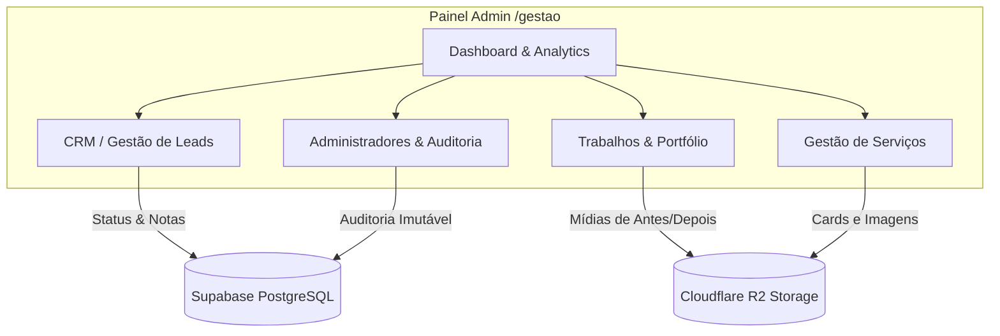
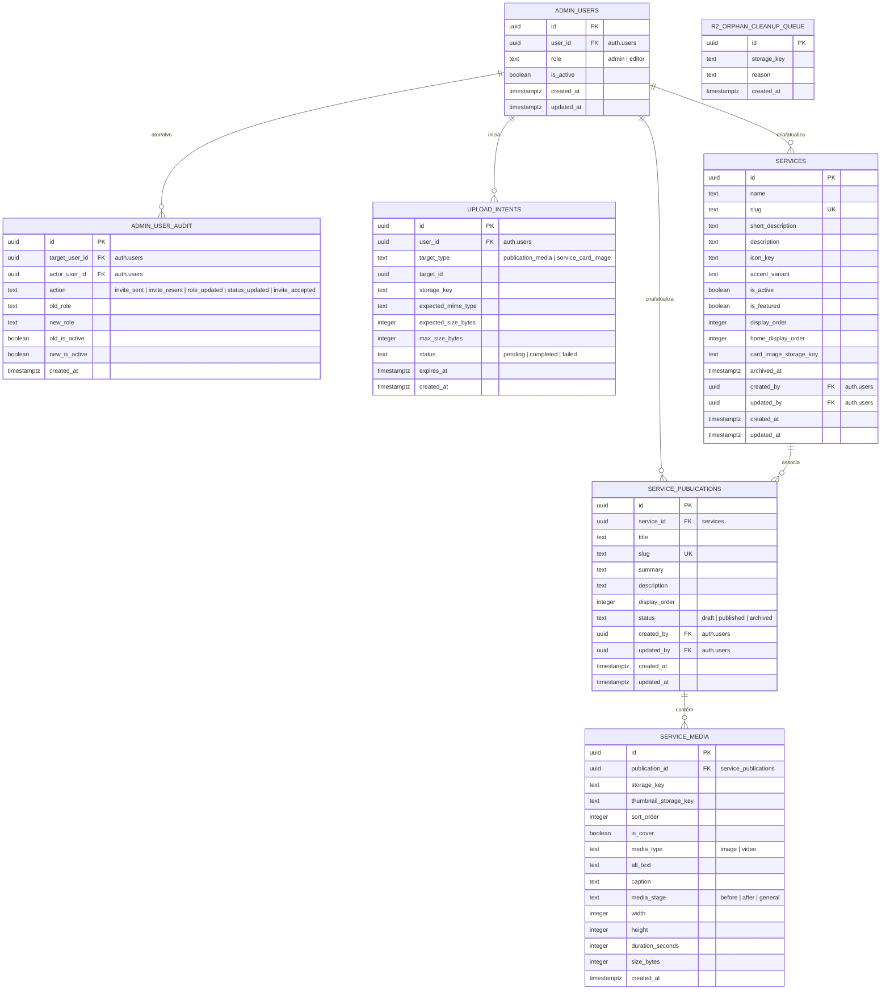

# Documento de Requisitos do Produto (PRD) — Painel Administrativo

## Projeto: A Portamóvel Serralheria & Gestão Comercial
## Subsistema: Painel de Gestão (`/gestao`)

---

## 1. 📌 Visão Geral e Objetivos do Painel de Gestão

O **Painel de Gestão** (`/gestao`) é a central operacional e de inteligência comercial da A Portamóvel. Desenvolvido para uso exclusivo de administradores e editores da empresa, seus objetivos principais são:

1. **CRM Leve (Gestão de Leads)**: Acompanhar, registrar observações imutáveis e alterar o status comercial de cada lead gerado nos formulários públicos do site.
2. **Dashboard de Analytics (HogQL)**: Monitorar o tráfego do site público em tempo real (visitantes únicos, pageviews, cliques em telefones/WhatsApp e formulários enviados) por meio de integração direta com o PostHog, sem armazenar dados pessoais (PII) de clientes no analytics.
3. **Gestão de Trabalhos & Portfólio**: Cadastrar publicações de casos reais da serralheria (com fotos e vídeos de "antes e depois"), hospedando as mídias no Cloudflare R2.
4. **Gestão de Serviços**: Controlar as verticais de serviço listadas no portal institucional, alterando descrições, ordens de exibição e imagens de card.
5. **Gestão de Administradores & Auditoria**: Convidar novos usuários, alterar níveis de permissão (RBAC) e acompanhar um log imutável de todas as ações administrativas executadas.

---

## 2. 🔐 Controle de Acesso e Segurança (RBAC & Auth)

O ambiente administrativo adota restrições rigorosas baseadas em privilégios mínimos:

### 2.1 Autenticação e Proteção de Rotas
* **Middleware de Proteção (`middleware/gestao.ts`)**: Valida se há uma sessão ativa no Supabase Auth e se o usuário possui registro correspondente ativo na tabela `public.admin_users`. Caso contrário, redireciona ao `/gestao/login`.
* **Fluxo de Recuperação/Redefinição de Senha**: Utiliza fluxos nativos de e-mail seguro do Supabase Auth para disparo de links temporários com redefinição direta no painel.

### 2.2 Roles e Níveis de Permissão (RBAC)
O painel diferencia usuários em dois níveis de acesso na tabela `public.admin_users`:

| Recurso / Ação | Papel: `admin` | Papel: `editor` |
|---|---|---|
| Acesso ao Dashboard e Analytics | Sim | Sim |
| Ver Leads, Filtrar e Inserir Notas | Sim | Sim |
| Alterar Status Comercial do Lead | Sim | Sim |
| **Arquivar ou Desarquivar Leads** | **Sim** | **Não** |
| Criar/Editar/Publicar Trabalhos e Serviços | Sim | Sim |
| **Convidar Novos Usuários** | **Sim** | **Não** |
| **Alterar Função/Status de Usuários** | **Sim** | **Não** |
| **Visualizar Logs de Auditoria** | **Sim** | **Não** |

### 2.3 Medidas de Segurança Adicionais
* **Bloqueio de Contas**: Um administrador pode desativar qualquer usuário (`is_active = false`) para revogar o acesso imediatamente, sem excluir o registro do banco de dados (o que preservaria a integridade da auditoria).
* **Proteção de PII em Busca**: Para evitar vazamentos de dados de clientes em logs de tráfego (query strings), a pesquisa de leads utiliza requisições `POST /api/admin/leads/search` com o termo de busca no corpo JSON.
* **Salvaguardas de Banco**: É impossível alterar o próprio status, a própria função ou desativar o último administrador ativo no sistema (regras validadas diretamente em triggers e procedures no PostgreSQL).

---

## 3. 🗺️ Funcionalidades e Fluxos Detalhados

### 3.1 Dashboard de Analytics & Telemetria
Exibe dados de tráfego consolidados a partir do PostHog via consultas HogQL no servidor.
* **Métricas Principais (KPIs)**:
  * *Visitantes Únicos*: Total de pessoas no período selecionado.
  * *Visualizações*: Número agregado de páginas visualizadas.
  * *Cliques no WhatsApp*: Frequência de acionamento do CTA de conversa rápida.
  * *Cliques em Telefones*: Ligações discadas a partir de links no site.
  * *Solicitações Enviadas*: Formulários de orçamento submetidos com sucesso.
* **Filtros e Controles**: Seletor de período temporal (Últimos 7 dias, 30 dias, 90 dias) e botão para atualização manual das métricas (`refresh`).
* **Visualizações Comportamentais**:
  * Gráfico de linha temporal de acessos.
  * Tabelas com páginas mais visitadas, serviços mais procurados, fontes de tráfego (UTMs e referrers) e geolocalização dos usuários (cidades/estados).
* **Resiliência de Rede**: Banner de alerta de cache caso o PostHog demore a responder (exibe dados do cache de 5 minutos) ou se houver erro crítico de comunicação.

### 3.2 Sistema de CRM & Gestão de Leads
Centraliza o atendimento comercial a partir das conversões de leads.
* **Filtros por Status**: Segmentação rápida de leads nos seguintes estados comerciais:
  * `new` (Novos)
  * `contacted` (Em contato)
  * `qualified` (Qualificados)
  * `proposal_sent` (Proposta Enviada)
  * `won` (Ganhos/Fechados)
  * `lost` (Perdidos)
  * `spam` (Spam)
  * `archived` (Arquivados — ocultos da listagem principal)
* **Busca e Paginação**: Campo de pesquisa textual para buscar por nome, e-mail, telefone ou condomínio. Paginação para listagens com grandes volumes de registros.
* **Drawer de Detalhes do Lead (`LeadDetailSheet`)**:
  * Exibição dos dados do cliente, metadados de marketing (UTM, URL de origem) e consentimento LGPD.
  * **Atualização Atômica de Status**: Lógica que realiza uma trava pessimista de linha (`FOR UPDATE`) no PostgreSQL por meio da RPC `update_lead_status_atomic` para evitar concorrência e gravar o histórico de alterações.
  * **Inserção de Observações**: Campo para que o comercial insira notas operacionais. As notas são imutáveis (sem permissão de edição/exclusão) para garantir conformidade de histórico de auditoria comercial.

### 3.3 Gestão de Trabalhos & Portfólio
Controle de publicações de casos de sucesso, depoimentos e reformas da serralheria no site público.
* **Ciclo de Publicação**: Uma publicação passa pelos status:
  * `draft` (Rascunho)
  * `published` (Publicada e visível no site institucional)
  * `archived` (Arquivada de volta à gestão interna)
* **Fluxo de Upload Seguro no Cloudflare R2**:
  1. O usuário seleciona arquivos de imagem/vídeo para a publicação.
  2. O backend cria uma intenção de upload (`upload_intents`) e gera uma URL assinada (`presigned_url`) autorizando o upload direto do navegador ao Cloudflare R2.
  3. Limites estritos de tamanho são validados: máximo de 10MB para fotos e 100MB para vídeos.
  4. Após o envio físico, o backend executa uma validação binária de assinatura do arquivo (*Magic Bytes*) para garantir que um executável malicioso não tenha sido renomeado para `.jpg` ou `.mp4`.
  5. Uma RPC no PostgreSQL finaliza o upload de forma atômica (`finalize_media_upload_atomic`), vinculando o arquivo à tabela `service_media` e marcando a intenção de upload como concluída.
* **Ordenação e Capa**: Permite que o administrador selecione qual mídia será a imagem de capa (`is_cover`) e reordene as mídias via arraste (persistido via RPC `reorder_media_atomic`).
* **Validação para Publicação**: O painel impede a transição para `published` caso o post não contenha mídias ou não possua exatamente uma imagem definida como capa.
* **Exclusão Física**: A exclusão de mídias ou posts remove os registros no banco de dados e dispara chamadas assíncronas para deletar os arquivos correspondentes do Cloudflare R2. Caso ocorra erro de rede, o arquivo é enfileirado na tabela `r2_orphan_cleanup_queue` para limpeza posterior.

### 3.4 Gestão de Serviços
Controla a lista de soluções e serviços expostos no catálogo público.
* **Edição de Cadastro**: Alteração de nome, descrição curta, descrição longa, ícones de representação e slug de rota.
* **Imagem de Destaque**: Upload da imagem que ilustra o serviço utilizando o mesmo fluxo estruturado de upload e assinatura no R2.
* **Ativação e Arquivamento**:
  * Um serviço recém-criado entra como inativo. A ativação no catálogo público é executada por meio da RPC `activate_service_atomic`.
  * Arquivar o serviço oculta-o instantaneamente do catálogo público.

### 3.5 Gestão de Administradores & Auditoria
Ferramentas de governança do painel administrativo.
* **Fluxo de Convite**:
  1. O administrador envia um convite inserindo o e-mail do destinatário e definindo a função inicial (`admin` ou `editor`).
  2. O backend faz uma reserva de convite (`acquire_admin_invite_reservation`), valida duplicidade de e-mail e dispara um convite seguro pelo Supabase Auth.
  3. O usuário convidado recebe o link seguro no e-mail e é direcionado à página `/gestao/aceitar-convite` para concluir a criação e senha do seu perfil.
  4. Em caso de perda do e-mail de convite, o administrador pode reenviar o convite (com limites de tentativa para evitar abuso/spam).
* **Moderação de Usuários**: Possibilidade de rebaixar/promover usuários e ativar/desativar contas.
* **Histórico de Auditoria Imutável (`admin_user_audit`)**:
  * Tabela que registra logs automáticos de ações críticas, como: convite enviado, convite reenviado, alteração de função (de/para), alteração de status ativo/inativo e aceite de convites.
  * O log exibe quem realizou a ação (ator) e quem sofreu a ação (alvo), com a data e hora exatas.

---

## 4. 🗄️ Modelo de Dados (Database Schema)

Esquema de banco de dados do subsistema administrativo no PostgreSQL:

---

## 5. 🔌 Contratos de Integrações e APIs (Rotas Administrativas)

Acesso restrito a usuários autenticados e ativos (validação em nível de sessão).

### 5.1 Analytics
* **`GET /api/admin/analytics/dashboard`**
  * **Query**: `period` (`7` | `30` | `90`)
  * **Retorno**: Estatísticas agregadas compiladas via PostHog HogQL (números consolidados, dados para gráfico temporal e rankings).

### 5.2 CRM de Leads
* **`GET /api/admin/leads`**
  * **Query**: `page`, `limit`, `status` (`new` | `contacted` | `qualified` | `proposal_sent` | `won` | `lost` | `spam` | `all`), `archived` (`true` | `false`)
  * **Retorno**: Lista de leads paginada e contagem por status.
* **`POST /api/admin/leads/search`**
  * **Payload**: `{ query: string, status: string, page: number, limit: number, archived: boolean }`
  * **Retorno**: Leads filtrados por busca textual segura de PII.
* **`GET /api/admin/leads/:id`**
  * **Retorno**: Detalhamento do lead, contendo histórico de status e notas associadas.
* **`PATCH /api/admin/leads/:id/status`**
  * **Payload**: `{ status: string }`
  * **Retorno**: Atualização atômica do status comercial com registro em log.
* **`POST /api/admin/leads/:id/notes`**
  * **Payload**: `{ note: string }`
  * **Retorno**: Nota cadastrada no histórico operacional.
* **`PATCH /api/admin/leads/:id/archive`**
  * **Payload**: `{ archived: boolean }` *(Apenas Admin)*
  * **Retorno**: Sucesso ou falha de arquivamento.

### 5.3 Mídias e Uploads
* **`POST /api/admin/media/presign`**
  * **Payload**: `{ publicationId: string, fileExtension: string, mimeType: string, expectedSizeBytes: number }`
  * **Retorno**: `{ intent_id: string, presigned_url: string, expires_in_seconds: number }`
* **`POST /api/admin/media/finalize`**
  * **Payload**: `{ intentId: string, altText: string, caption?: string, mediaStage?: string, isCover?: boolean, width?: number, height?: number, durationSeconds?: number }`
  * **Retorno**: Registro do arquivo de mídia finalizado na tabela `service_media`.
* **`DELETE /api/admin/media/:id`**
  * **Retorno**: Confirmação de exclusão e remoção física solicitada do R2.

### 5.4 Publicações e Portfólio
* **`GET /api/admin/publications`**
  * **Query**: `service_id`, `status`
  * **Retorno**: Listagem completa de publicações.
* **`POST /api/admin/publications`**
  * **Payload**: `{ service_id: string, title: string, slug: string, summary: string, description: string, display_order: number }`
  * **Retorno**: Publicação criada no status `draft`.
* **`PATCH /api/admin/publications/:id`**
  * **Payload**: `{ service_id?, title?, slug?, summary?, description?, display_order? }`
  * **Retorno**: Dados da publicação editados.
* **`PATCH /api/admin/publications/:id/publish`**
  * **Retorno**: Publicação ativada no site (exige capa e mídias).
* **`PATCH /api/admin/publications/:id/unpublish`**
  * **Retorno**: Publicação alterada para `draft`.
* **`DELETE /api/admin/publications/:id`**
  * **Retorno**: Exclusão e limpeza física de mídias no R2.

### 5.5 Serviços
* **`GET /api/admin/services`**
  * **Retorno**: Lista de serviços ativos e inativos.
* **`POST /api/admin/services`**
  * **Payload**: `{ name, slug, short_description, description, icon_key, accent_variant, is_featured, display_order, home_display_order }`
  * **Retorno**: Serviço criado com sucesso.
* **`PATCH /api/admin/services/:id`**
  * **Payload**: `{ name?, slug?, short_description?, description?, icon_key?, accent_variant?, is_featured?, display_order?, home_display_order? }`
  * **Retorno**: Serviço editado.
* **`PATCH /api/admin/services/:id/archive`**
  * **Payload**: `{ archived: boolean }`
  * **Retorno**: Serviço ocultado do site.

### 5.6 Controle de Usuários (Administradores) *(Apenas Admin)*
* **`GET /api/admin/users`**
  * **Query**: `search`, `role`, `status`, `page`, `limit`
  * **Retorno**: Listagem de administradores paginada e sumários (admins ativos, editores ativos, convites pendentes).
* **`POST /api/admin/users/invite`**
  * **Payload**: `{ email: string, role: string }`
  * **Retorno**: Concessão de acesso e convite disparado por e-mail via Supabase.
* **`POST /api/admin/users/:id/resend-invite`**
  * **Retorno**: Confirmação de reenvio do e-mail de OTP.
* **`PATCH /api/admin/users/:id/role`**
  * **Payload**: `{ role: string }`
  * **Retorno**: Alteração de permissão com log de auditoria.
* **`PATCH /api/admin/users/:id/status`**
  * **Payload**: `{ isActive: boolean }`
  * **Retorno**: Ativação/Desativação da conta com log de auditoria.
* **`GET /api/admin/users/audit`**
  * **Query**: `page`, `limit`, `userId`
  * **Retorno**: Lista paginada contendo o log detalhado de auditoria de alterações administrativas.
