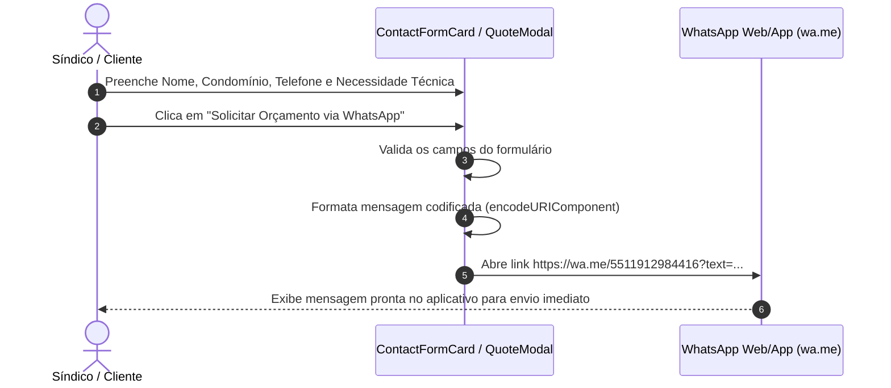

# Product Requirements Document (PRD)
## Projeto: A Portamóvel Serralheria — Engenharia de Segurança & Estruturas para Condomínios

---

### 1. Visão Geral do Produto

**A Portamóvel Serralheria** é uma empresa líder em engenharia de segurança, controle de acesso e serralheria técnica para condomínios residenciais e comerciais na Grande São Paulo. Com tradição iniciada em 1986 (quase 40 anos de mercado), a empresa combina infraestrutura física própria (laboratório técnico, frota registrada de veículos e equipe CLT especializada) com soluções modernas de tecnologia em segurança.

A plataforma web institucional tem como objetivo transmitir solidez, transparência operacional e converter potenciais clientes (síndicos, administradoras de condomínio e gerentes prediais) em contatos diretos de orçamento via WhatsApp e central telefônica.

---

### 2. Identidade Visual & Branding

- **Nome Comercial**: A Portamóvel Serralheria
- **Logotipo Oficial**:
  - Arquivo: `/images/logo.png` (disponível também em `/logo.png`)
  - Elementos Visuais: Ícone de cobertura/portão em forma de casa nas cores azul institucional e vermelho, com painéis brancos.
- **Paleta de Cores**:
  - Azul Institucional Primário: `#09357a`
  - Azul TopBar / Rodapé: `#0b2d63` / `#002766`
  - Vermelho Destaque / Emergência: `#b91c1c`
  - Fundo & Superfícies: `#ffffff`, `bg-blue-50/80`
- **Tipografia**: Sans-serif moderna, limpa e legível (Inter/System Font) com excelente hierarquia visual e suporte responsive.

---

### 3. Objetivos do Projeto

1. **Apresentação Institucional de Alto Impacto**: Destacar a história desde 1986, a infraestrutura operacional própria (laboratório e frota) e a identidade de serralheria técnica e engenharia de segurança.
2. **Exibição Detalhada dos Serviços**:
   - **Controle de Acesso**: Biometria facial, eclusas, catracas e tags veiculares.
   - **CFTV (Assistência 24h)**: Câmeras IP 4K e análise inteligente de vídeo.
   - **Comunicação / Interfonia**: Centrais analógicas/IP e videoporteiros.
   - **Contratos de Manutenção**: Atendimento preventivo e **SLA emergencial de até 6 horas**.
3. **Conversão Direta para WhatsApp & Central Telefônica**:
   - Redirecionamento de 100% dos formulários de orçamento para o WhatsApp oficial **(11) 91298-4416**.
   - Exibição visível dos 3 ramais fixos da central telefônica em todas as páginas.
4. **Experiência Multi-Página Responsiva**:
   - Navegação otimizada para Desktop, Tablet e Mobile nas rotas:
     - Home (`/`)
     - Serviços (`/servicos`)
     - Sobre Nós (`/sobre-nos`)
     - Contato (`/contato`)

---

### 4. Arquitetura Técnica & Tecnologias

- **Framework**: Nuxt 4 (Vue 3, TypeScript, Vite)
- **Estilização**: Tailwind CSS (`@nuxtjs/tailwindcss`)
- **Roteamento**: Nuxt File-based Router (`app/pages/`)
- **Componentização**: Arquitetura modular e limpa em `app/components/`
- **Ativos Estáticos**: Diretório `public/` (imagens em `public/images/`)
- **Regras de Qualidade de Código**:
  - Manutenibilidade estrita: arquivos modulares mantidos abaixo de 400 linhas.
  - Componentes reutilizáveis com prop types claros em TypeScript.

---

### 5. Canais Oficiais de Comunicação

- **Telefones Fixos (Central Telefônica)**:
  - `(11) 3991-0279`
  - `(11) 3991-0280`
  - `(11) 3991-0281`
- **WhatsApp Oficial (Plantão & Orçamentos)**:
  - **`(11) 91298-4416`** (`https://wa.me/5511912984416`)
- **Endereço da Sede Operacional**:
  - Rua Manoel Ramos, 26 - Jd. Maristela - Freguesia do Ó, São Paulo - SP

---

### 6. Estrutura de Páginas e Componentes

```
app/
├── components/
│   ├── AboutHeroSection.vue        # Banner e história institucional (Desde 1986)
│   ├── AboutStructureSection.vue   # Apresentação da frota e laboratório técnico
│   ├── ApprovedTechSection.vue     # Marcas e tecnologias homologadas
│   ├── AppHeader.vue               # Topbar, Logo A Portamóvel Serralheria e Menu Nav
│   ├── AppFooter.vue               # Rodapé com logo, links úteis e contatos
│   ├── ContactChannelsCard.vue     # Telefones fixos, WhatsApp, endereço e mapa
│   ├── ContactFormCard.vue         # Formulário com integração direta para WhatsApp
│   ├── DetailedServiceCard.vue     # Cards interativos de serviços com modal
│   ├── HeroSection.vue             # Banner principal da Home com foto da frota
│   ├── InfrastructureSection.vue   # Estrutura própria (Frota própria e CLT)
│   ├── QuoteModal.vue              # Modal de solicitação rápida de orçamento
│   ├── ServicesPageHero.vue        # Banner da página de serviços
│   ├── ServicesSection.vue         # Resumo dos serviços na Home
│   ├── TestimonialsSection.vue     # Depoimentos de síndicos e administradores
│   ├── TopPhoneBar.vue             # Barra superior azul com telefones fixos e WhatsApp
│   ├── VideoShowcaseSection.vue    # Demonstração em vídeo dos serviços
│   └── WhatsAppFloat.vue           # Botão flutuante global de WhatsApp
└── pages/
    ├── index.vue                   # Página Inicial (Home)
    ├── servicos.vue                # Portfólio completo de serviços
    ├── sobre-nos.vue               # História e infraestrutura da empresa
    └── contato.vue                 # Formulário e mapa de localização
```

---

### 7. Fluxo de Solicitação de Orçamento (WhatsApp)



---

### 8. Requisitos Não-Funcionais & Desempenho

1. **Desempenho & Carregamento Rápido**:
   - Imagens otimizadas armazenadas em `public/images/`.
   - CSS minificado via Tailwind CSS em tempo de build.
2. **SEO & Acessibilidade**:
   - Meta tags dinâmicas configuradas com `useHead` para cada página.
   - Atributos `aria-label`, contraste adequado de cores e navegabilidade via teclado.
3. **Responsividade Total**:
   - Layout fluido ajustado para smartphones, tablets e monitores ultrawide.
