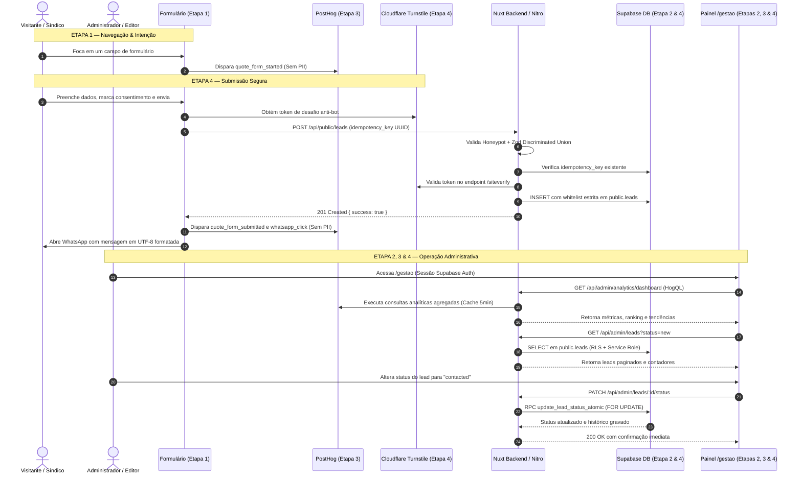
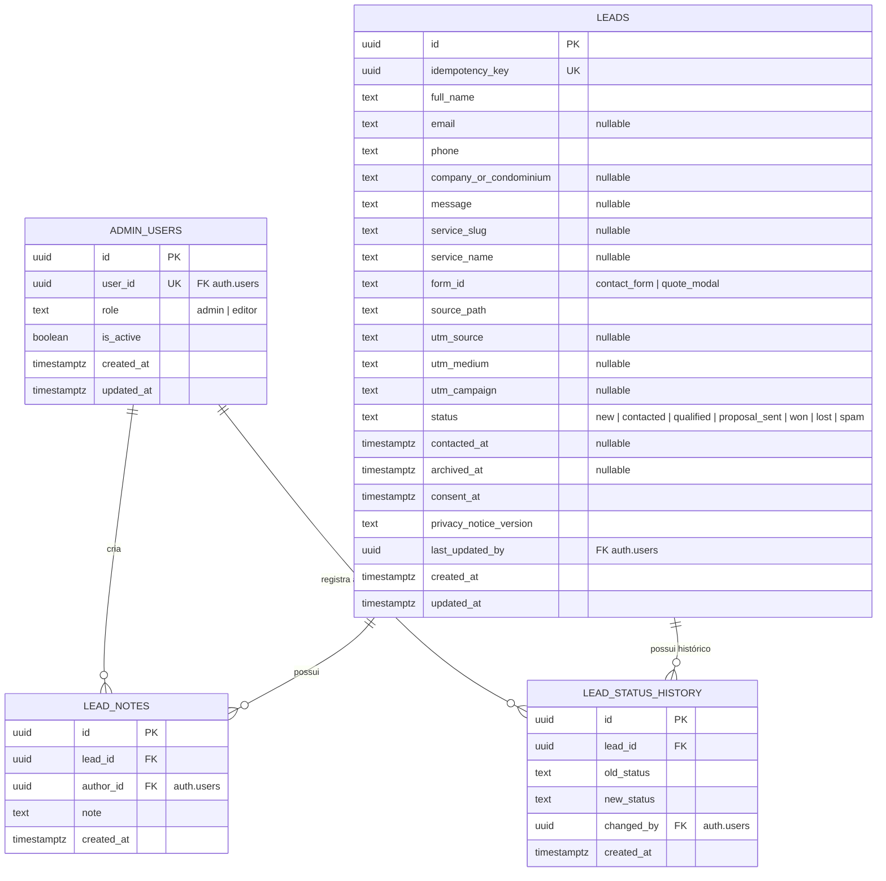

# Product Requirements Document (PRD) — Arquitetura Completa

## Projeto: A Portamóvel Serralheria & Gestão Comercial Inteligente

---

## 1. 📌 Visão Geral do Produto e Ecossistema

**A Portamóvel Serralheria** (fundada em 1986 — 40 anos de mercado) atua na engenharia de segurança, serralheria técnica estrutural e manutenção preditiva/corretiva de portões para condomínios e empresas na Grande São Paulo.

O produto digital é composto por dois grandes subsistemas integrados em um único monólito moderno:
1. **Portal Público Institucional de Alta Conversão**: Apresentação de autoridade, infraestrutura própria, portfólio de serviços, atendimento emergencial com SLA de 6h e captura de leads protegida contra spam com encaminhamento automático ao WhatsApp Comercial.
2. **Painel Administrativo Privado (`/gestao`)**: Ambiente com controle de acesso baseado em papéis (RBAC), telemetria e analytics agregados via PostHog sem PII, além de um sistema completo de gestão de leads (CRM leve) persistido no Supabase.

```mermaid
graph TD
    User([Visitante / Síndico]) -->|Navegação & Conversão| PublicSite[Portal Público Nuxt 4]
    PublicSite -->|Eventos Analíticos Sem PII| PostHog[(PostHog Analytics)]
    PublicSite -->|Token + Validação| Turnstile[Cloudflare Turnstile]
    PublicSite -->|Submissão de Lead Protegido| PublicAPI[API Pública /api/public/leads]
    PublicAPI -->|Idempotência + Whitelist| SupabaseDB[(Supabase PostgreSQL)]
    PublicSite -->|Encaminhamento Formatado| WhatsApp[WhatsApp Comercial]

    AdminUser([Administrador / Editor]) -->|Supabase Auth / MFA| AdminPanel[Painel de Gestão /gestao]
    AdminPanel -->|HogQL Server-side Agregado| PostHog
    AdminPanel -->|RLS / RPC Atômica| SupabaseDB
```

---

## 2. 🗺️ Mapa de Páginas e Funcionalidades Detalhadas

### 2.1 Páginas Públicas (Frontend Institucional)

| Rota | Componente Principal | Funcionalidades e Lógica de Negócio |
|---|---|---|
| `/` | `pages/index.vue` | **Home Page**: Hero dinâmico com carrossel da frota/serviços, grid de soluções, destaque de infraestrutura própria (CLT e laboratório técnico), vitrine de tecnologias homologadas, linha do tempo histórica (1986–2026), prova social (depoimentos de síndicos) e CTA global. |
| `/servicos` | `pages/servicos.vue` | **Catálogo de Serviços**: Apresentação das 7 verticais de atuação (Manutenção de portões, serralheria técnica, recuperação de gradis, kits de corrente, portas corta-fogo, trilhos e roldanas duplas). Cada card aciona o `QuoteModal` contextualizado com o slug do serviço. |
| `/sobre-nos` | `pages/sobre-nos.vue` | **Institucional**: História detalhada de 40 anos, valores éticos, apresentação dos veículos registrados e laboratório próprio de usinagem e testes. |
| `/contato` | `pages/contato.vue` | **Central de Atendimento**: Exibição dos telefones fixos `(11) 3991-0279 / 3991-0280`, mapa de localização na Freguesia do Ó e o formulário robusto `ContactFormCard.vue`. |
| Global (Header/Banner) | `EmergencyModal.vue` | **Atendimento de Emergência (SLA 6h)**: Lógica comutadora de horário. Das 07:00 às 16:00 direciona para a equipe comercial `(11) 91298-4416`; após as 16:00 e fins de semana, comuta para o Plantão Noturno 24h `(11) 94027-7438`. |

---

### 2.2 Páginas Administrativas (`/gestao`)

Todas as páginas sob `/gestao` são protegidas pelo middleware `gestao.ts`, que valida a sessão no Supabase Auth e o registro ativo em `public.admin_users`.

| Rota | Layout / Middleware | Funcionalidades e Lógica de Negócio |
|---|---|---|
| `/gestao/login` | `gestao-publica` | **Autenticação**: Login por e-mail e senha, bloqueio contra força bruta, feedback claro de credenciais inválidas ou conta inativa. |
| `/gestao/recuperar-senha` | `gestao-publica` | **Recuperação de Senha**: Disparo de e-mail seguro com link de redefinição via Supabase Auth. |
| `/gestao/redefinir-senha` | `gestao-publica` | **Redefinição de Senha**: Validação de token de recuperação (`type=recovery`) e atualização de senha em formulário protegido com critérios de força. |
| `/gestao` | `gestao` | **Dashboard Analítico**: Indicadores de visitantes únicos, pageviews, cliques em WhatsApp/telefones, conversões de formulário, gráfico temporal, ranking de páginas e serviços mais acessados, origens de tráfego, cidades/estados e card de leads recentes. |
| `/gestao/leads` | `gestao` | **Gestão de Leads (CRM)**: Tabela desktop e cards mobile com filtros por status (`new`, `contacted`, `qualified`, `proposal_sent`, `won`, `lost`, `spam`, `archived`), busca segura de PII via `POST /api/admin/leads/search`, drawer com detalhes completos, adição de observações imutáveis e alteração atômica de status. |

---

## 3. 🔄 Ciclo de Vida e Relação entre as 4 Etapas do Sistema

---

## 4. 🗄️ Modelo de Dados (Database Schema)

O banco de dados utiliza PostgreSQL 15+ hospedado no Supabase com isolamento total via Row Level Security (RLS) e `SET search_path = ''` em todas as rotas e funções atômicas.

---

### 4.1 Descrição Detalhada das Tabelas e Colunas

#### A. Tabela `public.admin_users`
Armazena a autorização e o papel administrativo de cada usuário cadastrado no Supabase Auth.
* `id` (`UUID`, PK): Identificador interno.
* `user_id` (`UUID`, UNIQUE, NOT NULL): Chave estrangeira que referencia `auth.users(id)` com `ON DELETE CASCADE`.
* `role` (`TEXT`, NOT NULL): Papel do usuário. Restrito por constraint a `'admin'` ou `'editor'`.
* `is_active` (`BOOLEAN`, NOT NULL, Default `true`): Flag que permite revogar acessos instantaneamente.
* `created_at` / `updated_at` (`TIMESTAMPTZ`, NOT NULL).

#### B. Tabela `public.leads`
Armazena todas as solicitações comerciais e orçamentos originados no site.
* `id` (`UUID`, PK, Default `gen_random_uuid()`): Identificador primário.
* `idempotency_key` (`UUID`, UNIQUE, NOT NULL): Chave de idempotência gerada no frontend para evitar duplicação por múltiplos cliques.
* `full_name` (`TEXT`, NOT NULL): Nome completo do solicitante (1 a 120 caracteres).
* `email` (`TEXT`, NULLABLE): E-mail de contato (obrigatório em `contact_form`, opcional em `quote_modal`).
* `phone` (`TEXT`, NOT NULL): Telefone/WhatsApp (8 a 30 caracteres).
* `company_or_condominium` (`TEXT`, NULLABLE): Nome do condomínio ou empresa cliente.
* `message` (`TEXT`, NULLABLE): Mensagem ou escopo técnico da necessidade (até 3000 caracteres).
* `service_slug` (`TEXT`, NULLABLE): Slug do serviço de interesse (ex: `troca-de-roldanas-duplas`).
* `service_name` (`TEXT`, NULLABLE): Nome legível do serviço selecionado.
* `form_id` (`TEXT`, NOT NULL): Identificador do formulário de origem (`contact_form` ou `quote_modal`).
* `source_path` (`TEXT`, NOT NULL): URL relativa onde a conversão ocorreu (ex: `/servicos`).
* `utm_source` / `utm_medium` / `utm_campaign` (`TEXT`, NULLABLE): Rastreamento de campanhas.
* `status` (`TEXT`, NOT NULL, Default `'new'`): Estado comercial do lead (`new`, `contacted`, `qualified`, `proposal_sent`, `won`, `lost`, `spam`).
* `contacted_at` (`TIMESTAMPTZ`, NULLABLE): Carimbo de quando o primeiro contato comercial foi efetuado.
* `archived_at` (`TIMESTAMPTZ`, NULLABLE): Se preenchido, oculta o lead da listagem operacional ativa.
* `consent_at` (`TIMESTAMPTZ`, NOT NULL): Registro temporal de consentimento LGPD.
* `privacy_notice_version` (`TEXT`, NOT NULL): Versão do aviso de privacidade no formato `YYYY-MM`.
* `last_updated_by` (`UUID`, NULLABLE): FK para `auth.users(id)` do último admin que alterou o registro.
* `created_at` / `updated_at` (`TIMESTAMPTZ`, NOT NULL).

#### C. Tabela `public.lead_notes` (Imutável)
Registra observações operacionais e histórico de negociações.
* `id` (`UUID`, PK).
* `lead_id` (`UUID`, NOT NULL, FK `public.leads(id)` `ON DELETE CASCADE`).
* `author_id` (`UUID`, NOT NULL, FK `auth.users(id)`).
* `note` (`TEXT`, NOT NULL, 1 a 2000 caracteres): Conteúdo da observação.
* `created_at` (`TIMESTAMPTZ`, NOT NULL).
* *Segurança*: Sem permissão de `UPDATE` ou `DELETE` para preservar a auditoria jurídica.

#### D. Tabela `public.lead_status_history` (Imutável)
Auditoria automática de cada transição de status comercial.
* `id` (`UUID`, PK).
* `lead_id` (`UUID`, NOT NULL, FK `public.leads(id)` `ON DELETE CASCADE`).
* `old_status` (`TEXT`, NOT NULL): Status anterior.
* `new_status` (`TEXT`, NOT NULL): Novo status atribuído.
* `changed_by` (`UUID`, NOT NULL, FK `auth.users(id)`).
* `created_at` (`TIMESTAMPTZ`, NOT NULL).

---

### 4.2 Funções e Triggers no Banco de Dados

1. **RPC Atômica Transacional: `update_lead_status_atomic(p_lead_id, p_new_status, p_user_id)`**:
   * Executa com `SECURITY DEFINER` e `SET search_path = ''`.
   * Valida se `p_user_id` é um administrador ou editor ativo em `public.admin_users`.
   * Aplica trava pessimista de linha (`SELECT status FROM public.leads WHERE id = p_lead_id FOR UPDATE`).
   * Atualiza o lead com o novo status, carimbo `updated_at`, `contacted_at` (quando aplicável) e `last_updated_by`.
   * Insere atomicamente um registro em `public.lead_status_history` dentro da mesma transação.
2. **Trigger de Atualização: `handle_lead_updated_at()`**:
   * Trigger executado `BEFORE UPDATE ON public.leads` para sincronizar automaticamente `NEW.updated_at = timezone('utc'::text, now())`.

---

## 5. 🛡️ Segurança, Proteção de Dados (LGPD) e Anti-Spam

1. **Blindagem de Permissões (Princípio do Menor Privilégio)**:
   * Acesso direto a todas as tabelas revogado (`REVOKE ALL`) para papéis públicos (`anon`, `authenticated`).
   * Somente o backend privado (`service_role`) possui privilégios mínimos de `SELECT`, `INSERT` e `UPDATE`.
   * Nenhuma chave secreta (`SUPABASE_SECRET_KEY`, `TURNSTILE_SECRET_KEY`, `POSTHOG_PERSONAL_API_KEY`) é exposta no bundle client-side.
2. **Proteção Anti-Spam com Cloudflare Turnstile & Honeypot**:
   * Campo oculto honeypot `_hp_company_title`: se preenchido por robôs, a requisição é descartada silenciosamente retornando `200 OK`.
   * Validação obrigatória do token Turnstile no servidor contra a API da Cloudflare (`/siteverify`), conferindo `action` e `hostname` autorizado por ambiente.
   * Em caso de indisponibilidade da verificação, o sistema ativa um modo fallback explícito, permitindo que o usuário envie o orçamento diretamente pelo WhatsApp sem perder a mensagem.
3. **Privacidade e LGPD**:
   * O PostHog é utilizado exclusivamente para telemetria comportamental agregada. **Nenhum dado pessoal (nome, e-mail, telefone, mensagem ou IP) é enviado ao PostHog.**
   * O consentimento é formalmente exigido em todos os formulários com gravação da versão do termo (`LEAD_PRIVACY_NOTICE_VERSION`).
   * Buscas por PII no painel administrativo utilizam exclusivamente `POST /api/admin/leads/search` com corpo JSON, impedindo vazamento de dados de clientes em logs de URLs (query strings) de proxies ou navegadores.

---

## 6. 🔌 Contratos das APIs

### 6.1 Endpoints Públicos

* `POST /api/public/leads`
  * **Payload**: `form_id`, `name`, `phone`, `email` (se `contact_form`), `company_or_condominium`, `message`, `service_name`, `service_slug`, `source_path`, `idempotency_key`, `turnstile_token`, `consent`, `_hp_company_title`.
  * **Respostas**: `201 Created` (ou `200 OK` idempotente), `400 Bad Request`, `503 Service Unavailable`.

### 6.2 Endpoints Administrativos (Requer Cookie de Sessão Válido)

* `GET /api/admin/analytics/dashboard?period=7|30|90` ➔ Retorna indicadores de audiência, tendências e rankings do PostHog com cache server-side.
* `GET /api/admin/leads?page=1&limit=20&status=new|all&form_id=all&period=all&archived=false` ➔ Retorna lista paginada e contadores por status.
* `POST /api/admin/leads/search` ➔ Busca protegida por nome, telefone, e-mail ou condomínio via corpo JSON `{ query, status, page, limit, archived }`.
* `GET /api/admin/leads/recent` ➔ Retorna os 5 leads mais recentes para o Dashboard.
* `GET /api/admin/leads/:id` ➔ Retorna os dados completos do lead, notas e histórico de alterações.
* `PATCH /api/admin/leads/:id/status` ➔ Altera o status comercial de forma atômica via RPC `{ status }`.
* `POST /api/admin/leads/:id/notes` ➔ Adiciona uma nota operacional imutável `{ note }`.
* `PATCH /api/admin/leads/:id/archive` ➔ Arquiva ou desarquiva um lead (restrito ao papel `admin`).
* `GET /api/auth/me` ➔ Retorna os dados de perfil e papel do administrador autenticado.
