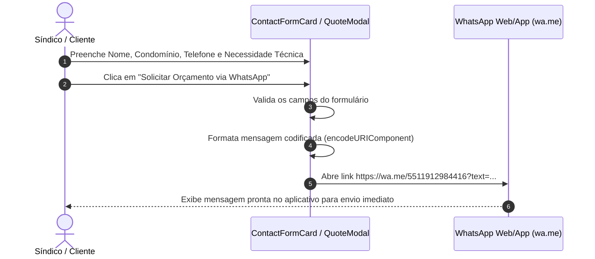
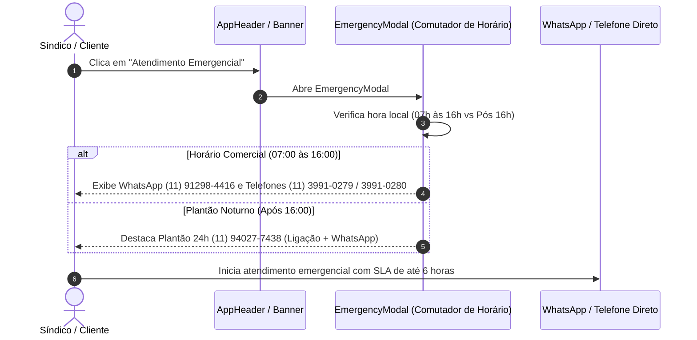

# Product Requirements Document (PRD)
## Projeto: A Portamóvel Serralheria — Engenharia de Segurança & Estruturas para Condomínios

---

### 1. Visão Geral do Produto

**A Portamóvel Serralheria** é uma empresa especializada em engenharia de segurança, serralheria técnica e manutenção preventiva e corretiva de portões para condomínios residenciais e comerciais na Grande São Paulo. Com uma tradição consolidada iniciada em **1986 (40 anos de mercado celebrados em 2026)**, a empresa combina infraestrutura operacional própria (laboratório técnico, frota registrada de veículos e equipe CLT especializada) com alto padrão de execução.

A plataforma web institucional tem como objetivo transmitir solidez, transparência operacional e converter potenciais clientes (síndicos, administradores de condomínios e gerentes prediais) em contatos diretos via WhatsApp e central telefônica.

**Slogan Institucional**: *"Não Substitua. Recupere, renove e valorize o patrimônio do seu condomínio."*

---

### 2. Identidade Visual & Branding

- **Nome Comercial**: A Portamóvel Serralheria
- **Logotipo Oficial**:
  - Arquivo: `/images/logo.png` (disponível também em `/logo.png`)
  - Elementos Visuais: Ícone de cobertura/portão em forma de casa nas cores azul institucional e vermelho, com painéis brancos.
- **Paleta de Cores**:
  - Azul Institucional Primário: `#09357a`
  - Azul TopBar / Central: `#002d6b` / `#0b2d63`
  - Vermelho Destaque / Emergência: `#b91c1c`
  - Tom Alerta Compromisso Tático: `#d97768`
  - Verde WhatsApp: `#10b981` / `bg-emerald-500`
  - Fundo & Superfícies: `#ffffff`, `bg-gray-50/60`, `bg-blue-50/90`
- **Tipografia**: Sans-serif moderna, limpa e legível (System Font / Inter) com excelente hierarquia visual e suporte responsivo.

---

### 3. Objetivos do Projeto

1. **Apresentação Institucional de Alto Impacto**:
   - Destacar a história de 40 anos (1986 - 2026).
   - Apresentar a infraestrutura própria (frota registrada, laboratório técnico e corpo de profissionais CLT).
   - Reforçar a visão de recuperação e valorização patrimonial sem necessidade de substituições desnecessárias.
2. **Exibição Detalhada dos Serviços de Serralheria e Manutenção**:
   - **Manutenção de Portões de Garagem e Pedestres**: Atendimento preventivo e corretivo para portões automáticos e manuais.
   - **Serralheria em Geral**: Reformas, ajustes e fabricação de estruturas metálicas personalizadas.
   - **Recuperação e Repintura de Gradis**: Restauração estética e proteção contra corrosão e intempéries.
   - **Troca de Cabos de Aço por Kit de Corrente**: Solução técnica para redução de ruídos, aumento de segurança e eliminação de quebras frequentes.
   - **Portas Corta-Fogo & Estruturas Metálicas**: Manutenção, ajustes e adequação total às normas vigentes.
   - **Troca de Trilhos Inferiores e Superiores**: Garantia de deslizamento suave e alinhamento do sistema.
   - **Troca de Roldanas Simples por Roldanas Duplas (Truck)**: Maior estabilidade e distribuição de carga em portões pesados.
3. **Compromisso Tático & SLA de Emergência**:
   - **Atendimento de Emergência em até 6 horas** para chamados prioritários.
   - Modal interativo inteligente de emergência com suporte diurno e plantão noturno 24 horas.
4. **Conversão Direta para WhatsApp & Central Telefônica**:
   - Encaminhamento direto de 100% dos formulários de orçamento para o WhatsApp oficial **(11) 91298-4416**.
   - Acesso rápido ao Plantão 24h via WhatsApp / Ligação no número **(11) 94027-7438**.
   - Exibição visível das 2 linhas fixas da central telefônica em todas as páginas: **(11) 3991-0279** e **(11) 3991-0280**.

---

### 4. Arquitetura Técnica & Tecnologias

- **Framework**: Nuxt 4 (Vue 3, TypeScript, Vite)
- **Estilização**: Tailwind CSS (`@nuxtjs/tailwindcss`)
- **Roteamento**: Nuxt File-based Router (`app/pages/`)
- **Componentização**: Arquitetura modular e limpa em `app/components/` (25 componentes organizados)
- **Ativos Estáticos**: Diretório `public/` (imagens em `public/images/` e subdiretórios de serviços)
- **Regras de Qualidade de Código**:
  - Manutenibilidade estrita: arquivos modulares mantidos abaixo de 400 linhas.
  - Componentes reutilizáveis com prop types claros em TypeScript.

---

### 5. Canais Oficiais de Comunicação

- **Central Telefônica (Fixos)**:
  - `(11) 3991-0279`
  - `(11) 3991-0280`
- **WhatsApp Oficial (Horário Comercial 07:00 às 16:00)**:
  - **`(11) 91298-4416`** (`https://wa.me/5511912984416`)
- **Plantão 24h & Emergências (Após as 16:00)**:
  - **`(11) 94027-7438`** (`https://wa.me/551194027438` / `tel:11940277438`)
- **Endereço da Sede Operacional**:
  - Rua Manoel Ramos, 26 - Jd. Maristela - Freguesia do Ó, São Paulo - SP

---

### 6. Estrutura de Páginas e Componentes

```
app/
├── components/
│   ├── AboutHeroSection.vue        # Banner e introdução da página Sobre Nós
│   ├── AboutStructureSection.vue   # Apresentação da frota própria e laboratório técnico
│   ├── AboutValuesSection.vue      # Valores institucionais, Missão, Visão e compromisso
│   ├── ApprovedTechSection.vue     # Marcas e tecnologias parceiras/homologadas
│   ├── AppFooter.vue               # Rodapé institucional com links, telefones e copyright
│   ├── AppHeader.vue               # Topbar, Logo, navegação principal e botão de emergência
│   ├── CompanyTimelineSection.vue  # Linha do tempo interativa da história (1986 - 2026)
│   ├── ContactChannelsCard.vue     # Card de telefones fixos, WhatsApp, endereço e mapa
│   ├── ContactFormCard.vue         # Formulário com integração direta para WhatsApp
│   ├── DetailedServiceCard.vue     # Cards detalhados de serviços com modal descritivo
│   ├── EmergencyBanner.vue         # Faixa vermelha em destaque de atendimento emergencial
│   ├── EmergencyModal.vue          # Modal de emergência com separação por horário e plantão 24h
│   ├── HeroSection.vue             # Banner da Home com carrossel automático da frota e serviços
│   ├── InfrastructureSection.vue   # Destaque de infraestrutura (Frota própria e CLT)
│   ├── QuoteModal.vue              # Modal rápido para solicitação de orçamento via WhatsApp
│   ├── ServiceCard.vue             # Componente modular reutilizável para cards de serviço
│   ├── ServicesPageHero.vue        # Banner da página de serviços
│   ├── ServicesSection.vue         # Resumo de serviços em formato de grid na Home
│   ├── ServicesShowcaseSection.vue # Vitrine interativa dos 5 principais serviços com modal
│   ├── TechComplementarySection.vue# Tecnologias e marcas complementares
│   ├── TestimonialCard.vue         # Card modular de depoimento de síndico/administrador
│   ├── TestimonialsSection.vue     # Carrossel/Grid de depoimentos de clientes
│   ├── TopPhoneBar.vue             # Barra superior escura com telefones fixos e WhatsApp
│   ├── VideoShowcaseSection.vue    # Seção com demonstrações em vídeo (Antes x Depois)
│   └── WhatsAppFloat.vue           # Botão flutuante global para contato via WhatsApp
└── pages/
    ├── index.vue                   # Página Inicial (Home)
    ├── servicos.vue                # Página de Serviços & Vitrine
    ├── sobre-nos.vue               # Página Institucional (História, Estrutura e Valores)
    └── contato.vue                 # Página de Contato (Canais, Formulário e Localização)
```

---

### 7. Fluxo de Interação e Orçamentos

#### A. Solicitação de Orçamento Standard via WhatsApp



#### B. Modal de Atendimento Emergencial inteligente (24h)



---

### 8. Requisitos Não-Funcionais & Desempenho

1. **Desempenho & Carregamento Rápido**:
   - Imagens otimizadas armazenadas em `public/images/` com atributos `loading="lazy"` ou `eager` apropriados no carrossel.
   - Minificação de CSS via `@nuxtjs/tailwindcss` em tempo de build.
2. **SEO & Acessibilidade**:
   - Meta tags dinâmicas configuradas com `useHead` para cada página (`index`, `servicos`, `sobre-nos`, `contato`).
   - Atributos `aria-label`, contraste adequado de cores e navegabilidade acessível via teclado.
   - Suporte a `prefers-reduced-motion` em animações e linha do tempo.
3. **Responsividade Total**:
   - Layout fluido ajustado para smartphones, tablets e monitores ultrawide.
   - Altura touch amigável (mínimo 44px/48px) para botões de atalho mobile.

